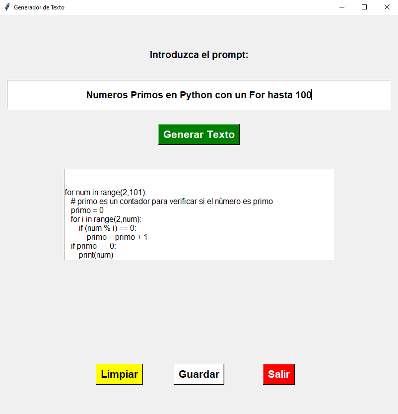

# API_ChatGPT_Python
Cómo utilizar la API de OpenAI para generar texto con ChatGPT en Python

Este proyecto es un tutorial sobre cómo generar texto con la tecnología de lenguaje natural utilizando el modelo ChatGPT de OpenAI y la API de OpenAI en Python. El tutorial enseña cómo interactuar con la interfaz de usuario (UI) que se ha creado con la biblioteca de Python tkinter, y cómo utilizar las herramientas mencionadas para generar texto coherente y relevante a partir de un prompt (instrucción). Se requiere una clave de API válida para utilizar la API de OpenAI y se utilizan las bibliotecas de Python, tkinter y OpenAI en este proyecto

URL DEL POST: https://advisertecnology.com/index.php/2023/05/04/como-utilizar-la-api-de-openai-para-generar-texto-con-chatgpt-en-python/?preview_id=5907&preview_nonce=327538487c&preview=true
